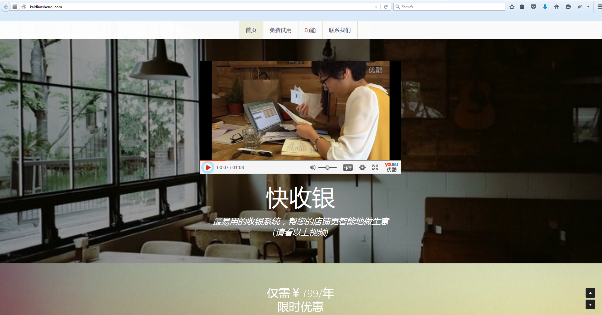

# Technology Used.

1. language: Ruby
2. platform: Rails
3. front end script: jQuery, Coffeescript, Twitter bootstrap, CSS3
4. main gem: devise, fusioncharts-rails, passenger.
5. main feature: 
>1. QR code scanner.
>2. Data statistics using fusioncharts-rails
>3. Payment integration using Stripe.
>4. Sendgrid API integration for mailing.
>5. pixel perfect responsive web design using twitter bootstrap

6. hosting: Heroku deploying.

# Portfolio

